# High-Level Business Flow

**Complete end-to-end business journey from raw market data to actionable trading insights.**

---

## Overview

This diagram shows the **7 major business stages** that transform raw tick data into validated range bars and trading insights. Each stage represents a critical business function that adds value to the data.

---

## Complete Business Flow Diagram

```mermaid
graph TB
    Start[Business Need:<br/>Trading Insights] --> Stage1

    subgraph Stage1["1️⃣ Symbol Discovery"]
        S1_Action[Discover Available Symbols]
        S1_Output[📊 Symbol Lists<br/>Market Availability Matrix]
        S1_Action --> S1_Output
    end

    subgraph Stage2["2️⃣ Data Validation"]
        S2_Action[Validate Data Structure<br/>& Schema]
        S2_Output[✅ Validation Reports<br/>Format Verification]
        S2_Action --> S2_Output
    end

    subgraph Stage3["3️⃣ Data Acquisition"]
        S3_Source1[Binance: Crypto<br/>Spot/UM/CM Futures]
        S3_Source2[Exness: Forex<br/>EURUSD_Raw_Spread]
        S3_Normalize[Normalize to<br/>AggTrade Format]
        S3_Output[📦 Normalized Tick Data<br/>Unified Format]

        S3_Source1 --> S3_Normalize
        S3_Source2 --> S3_Normalize
        S3_Normalize --> S3_Output
    end

    subgraph Stage4["4️⃣ Data Preprocessing"]
        S4_Convert[Convert CSV to Parquet]
        S4_Validate[Schema Validation]
        S4_Output[💾 Validated Parquet Files<br/>Optimized Storage]

        S4_Convert --> S4_Validate
        S4_Validate --> S4_Output
    end

    subgraph Stage5["5️⃣ Range Bar Generation"]
        S5_Core[Apply Non-Lookahead<br/>Algorithm]
        S5_Fixed[Fixed-Point Arithmetic<br/>No Float Errors]
        S5_Output[📈 Range Bar Sequences<br/>OHLCV + Metadata]

        S5_Core --> S5_Fixed
        S5_Fixed --> S5_Output
    end

    subgraph Stage6["6️⃣ Statistical Analysis"]
        S6_Stats[Calculate Statistics:<br/>Price, Volume, Duration]
        S6_Multi[Multi-Symbol<br/>Parallel Analysis]
        S6_Output[📊 Analysis Reports<br/>Comparative Metrics]

        S6_Stats --> S6_Multi
        S6_Multi --> S6_Output
    end

    subgraph Stage7["7️⃣ Export & Delivery"]
        S7_Format[Choose Format:<br/>CSV, Parquet, Arrow, IPC]
        S7_Export[Export via Polars]
        S7_Output[📁 Structured Bar Data<br/>Ready for Trading System]

        S7_Format --> S7_Export
        S7_Export --> S7_Output
    end

    Stage1 --> Stage2
    Stage2 --> Stage3
    Stage3 --> Stage4
    Stage4 --> Stage5
    Stage5 --> Decision{Need<br/>Statistics?}

    Decision -->|Yes| Stage6
    Decision -->|No| Stage7

    Stage6 --> Stage7
    Stage7 --> End[Business Value:<br/>Actionable Trading Insights]

    %% Styling
    style Start fill:#e1f5ff,stroke:#333,stroke-width:2px
    style End fill:#ffd700,stroke:#333,stroke-width:3px

    style S1_Output fill:#fff4e1
    style S2_Output fill:#e1ffe1
    style S3_Output fill:#fff4e1
    style S4_Output fill:#e1f5ff
    style S5_Output fill:#fff4e1
    style S6_Output fill:#e1ffe1
    style S7_Output fill:#ffd700

    style Decision fill:#ffe1e1,stroke:#333,stroke-width:2px
```

---

## Business Stage Details

### 1️⃣ **Symbol Discovery**

**Business Purpose**: Identify which financial instruments are available for analysis

**Key Actions**:
- Discover Tier-1 crypto symbols (18+ instruments across 3 Binance markets)
- Identify available forex pairs (EURUSD variants)
- Generate market availability matrix

**Business Outputs**:
- Symbol lists categorized by market type
- Multi-market availability indicators
- Data availability date ranges

**Business Value**: Ensures you're analyzing the most liquid, reliable instruments

---

### 2️⃣ **Data Validation**

**Business Purpose**: Verify data quality before expensive processing

**Key Actions**:
- Validate CSV/Parquet schema correctness
- Verify column naming conventions
- Check timestamp format consistency
- Detect data corruption early

**Business Outputs**:
- Schema validation reports (pass/fail per file)
- Format verification confirmations
- Data quality scores

**Business Value**: Prevents processing bad data (saves time and compute costs)

---

### 3️⃣ **Data Acquisition**

**Business Purpose**: Obtain raw market data from multiple sources

**Data Sources**:
- **Binance (Crypto)**: Spot, UM Futures (USDT), CM Futures (Coin-margined)
- **Exness (Forex)**: EURUSD_Raw_Spread with 8× higher spread variability

**Key Actions**:
- Fetch historical tick data (CSV/ZIP archives)
- Normalize timestamps to microseconds (16-digit)
- Convert to unified `AggTrade` format
- Handle multi-market data differences

**Business Outputs**:
- Normalized tick data (price, volume, timestamp)
- Unified format regardless of source
- Temporal integrity guaranteed

**Business Value**: Single processing pipeline for all asset classes

---

### 4️⃣ **Data Preprocessing**

**Business Purpose**: Optimize data storage and access speed

**Key Actions**:
- Convert CSV (slow reads) to Parquet (10× faster)
- Validate schema during conversion
- Compress data for storage efficiency
- Enable columnar access patterns

**Business Outputs**:
- Validated Parquet files (compressed, fast)
- Schema-verified datasets
- Optimized for analytical queries

**Business Value**: Faster analysis, lower storage costs, quality assurance

---

### 5️⃣ **Range Bar Generation**

**Business Purpose**: Transform tick data into range bars with non-lookahead guarantee

**Key Actions**:
- Apply threshold-based bar closing algorithm
- Use fixed-point arithmetic (8-decimal precision, no float errors)
- Ensure breach tick always included in closing bar
- Generate OHLCV + market microstructure metadata

**Business Outputs**:
- Range bar sequences (open, high, low, close, volume)
- Bar timestamps (open_time, close_time)
- Market microstructure data (buy/sell volume, trade counts)
- Deterministic, reproducible results

**Business Value**: Time-independent charting with guaranteed non-lookahead bias

**Why This Matters**: Traditional time-based bars can create lookahead bias. Range bars ensure no future information leaks into past decisions.

---

### 6️⃣ **Statistical Analysis** (Optional)

**Business Purpose**: Extract actionable insights from range bars

**Key Actions**:
- Calculate price statistics (mean, std dev, min, max)
- Calculate volume statistics (total, mean, distribution)
- Calculate bar duration statistics (avg time per bar)
- Multi-symbol parallel analysis (compare across markets)

**Business Outputs**:
- Analysis reports with comparative metrics
- Cross-symbol rankings (liquidity, volatility)
- Time-series statistics
- Market regime indicators

**Business Value**: Data-driven trading decisions, market selection, strategy optimization

---

### 7️⃣ **Export & Delivery**

**Business Purpose**: Deliver processed data to trading systems or analysis tools

**Export Formats**:
- **CSV**: Human-readable, universal compatibility
- **Parquet**: Compressed, fast analytical queries
- **Arrow**: Zero-copy interoperability
- **IPC**: Cross-language data exchange

**Key Actions**:
- Choose format based on downstream use case
- Export via Polars (high-performance DataFrame library)
- Maintain data integrity during export

**Business Outputs**:
- Structured bar data files
- Ready for backtesting engines
- Compatible with trading platforms
- Importable into Python/R/Julia

**Business Value**: Seamless integration with existing trading infrastructure

---

## Business Decision Points

### Critical Decision: Need Statistics?

**When to choose "Yes"**:
- Multi-symbol comparison required
- Need volatility/liquidity rankings
- Research or strategy development
- Historical analysis

**When to choose "No"**:
- Live trading (minimize latency)
- Simple bar export for external analysis
- Memory-constrained environments
- Already have external analytics

**Business Impact**:
- **Yes path**: Adds 10-30% processing time, generates insights
- **No path**: Faster export, minimal memory, raw bars only

---

## Data Transformation Chain

The data evolves through each stage:

1. **Stage 1**: Nothing → Symbol Lists
2. **Stage 2**: Symbol Lists → Validation Reports
3. **Stage 3**: Raw CSVs → Normalized AggTrade (tick data)
4. **Stage 4**: CSV AggTrade → Parquet AggTrade (faster, validated)
5. **Stage 5**: AggTrade (ticks) → RangeBars (OHLCV)
6. **Stage 6**: RangeBars → Statistics (insights)
7. **Stage 7**: RangeBars/Statistics → Files (deliverable)

**Key Insight**: Each stage adds business value - you can stop at any stage based on your needs.

---

## Processing Modes (Business Choice)

The system supports **2 processing modes** depending on your business needs:

### Streaming Mode
- **Use When**: Real-time trading, memory limits, live data
- **Characteristics**: Bounded memory (O(1)), processes one tick at a time
- **Trade-off**: Slower throughput, but never runs out of memory

### Batch Mode
- **Use When**: Historical analysis, multi-symbol research, statistics needed
- **Characteristics**: High throughput (Rayon parallelism), in-memory processing
- **Trade-off**: Faster processing, but memory usage = O(N bars)

**Business Decision**: Choose based on latency needs vs. memory constraints.

---

## Business Guarantees

### Non-Lookahead Guarantee
Every bar is constructed using **only past and current information**. No future tick data influences bar decisions.

**Why This Matters**: Prevents overfitting in backtests. If your backtest shows 80% win rate, it's real - not data peeking.

### Deterministic Output
Same input data + same threshold = **identical output bars** every time, on any platform.

**Why This Matters**: Reproducible research, auditable trading systems, regulatory compliance.

### Temporal Integrity
All timestamps are monotonic (strictly increasing). No time travel, no out-of-order data.

**Why This Matters**: Reliable event sequencing, accurate causality analysis.

### Precision Guarantee
8-decimal fixed-point arithmetic = **zero floating-point errors**.

**Why This Matters**: $0.00000001 difference in price can matter at scale. We guarantee exact math.

---

## Business Value Summary

**Input**: Raw, messy market data from multiple sources
**Output**: Clean, validated, non-lookahead range bars ready for trading

**Key Business Benefits**:
- ✅ **Time Saved**: Automated pipeline (vs. manual Excel processing)
- ✅ **Quality**: Validated at every stage (garbage in → detected early)
- ✅ **Trust**: Non-lookahead guarantee (backtests are honest)
- ✅ **Speed**: 1M ticks processed in <100ms (real-time capable)
- ✅ **Flexibility**: Multiple markets, multiple formats, multiple modes

---

## Next Steps

**New Users**: Follow this flow step-by-step using [Common Workflows Guide](../guides/common-workflows.md)

**Researchers**: Deep dive into [Algorithm Specification](../specifications/algorithm-spec.md) to understand Stage 5 guarantees

**Developers**: See [Architecture Overview](../ARCHITECTURE.md) for technical implementation details

---

## Related Diagrams

- [Business Use Cases](02-business-use-cases.md) - Who uses each stage *(coming soon)*
- [Data Acquisition Decisions](03-data-acquisition-decisions.md) - How to choose data sources *(coming soon)*
- [Processing Mode Decisions](04-processing-mode-decisions.md) - Streaming vs Batch logic *(coming soon)*
- [Error Recovery Logic](07-error-recovery-logic.md) - What happens when stages fail *(coming soon)*
