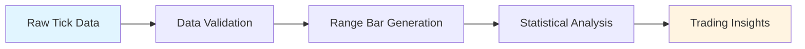
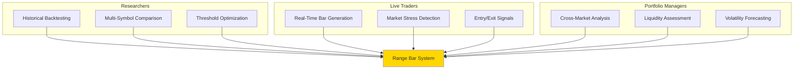
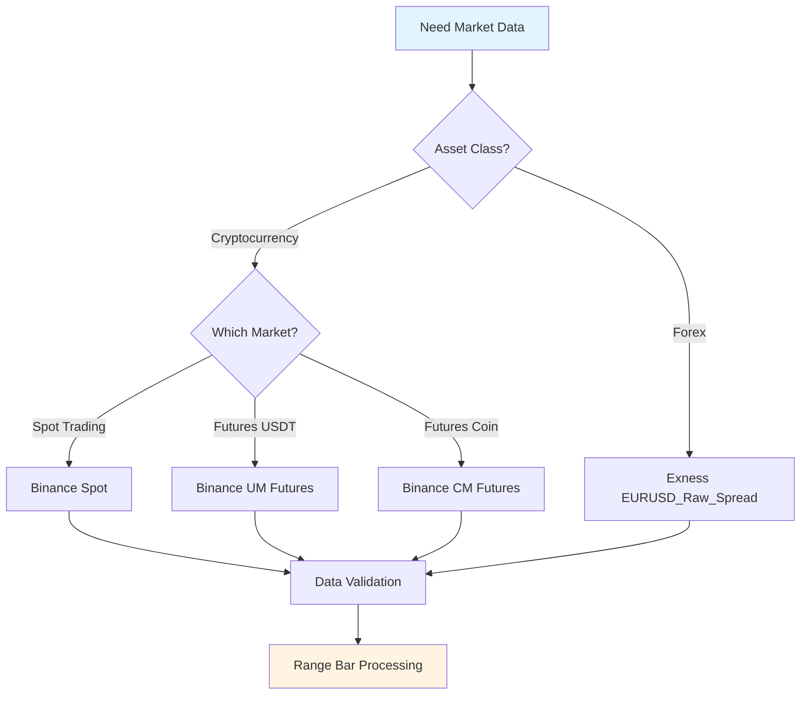
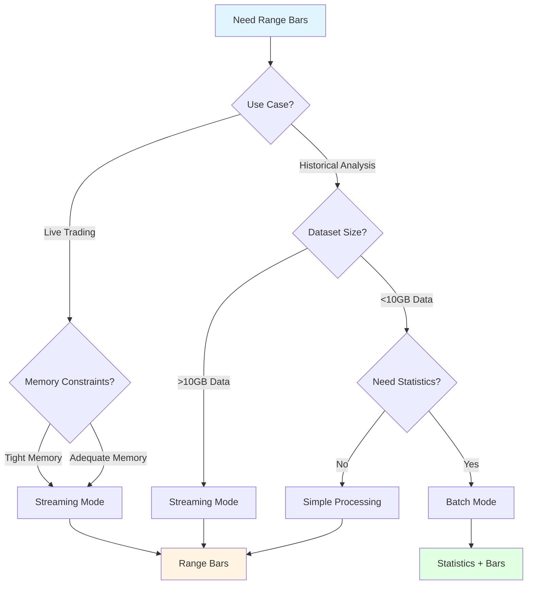
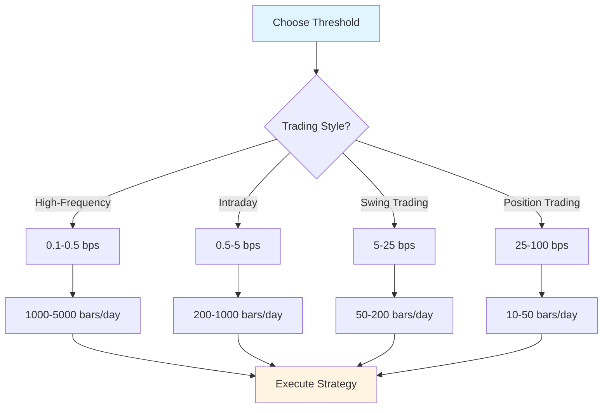
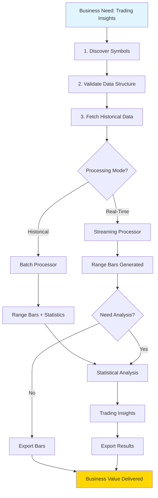
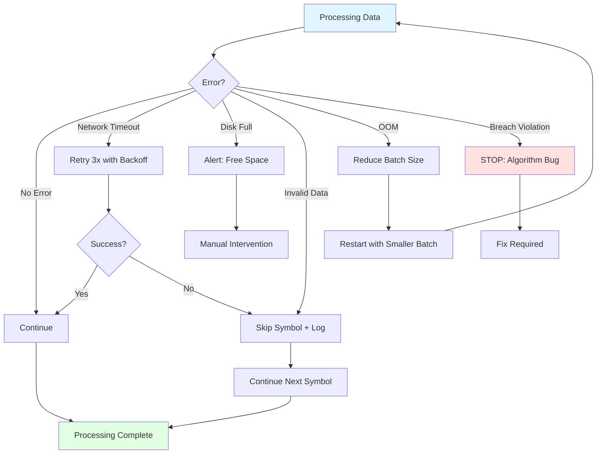
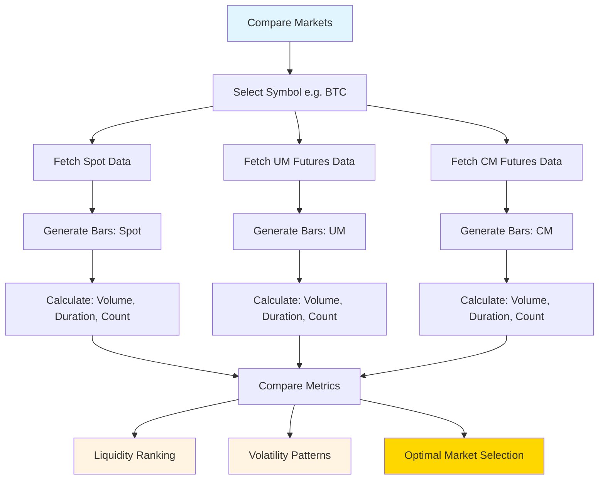
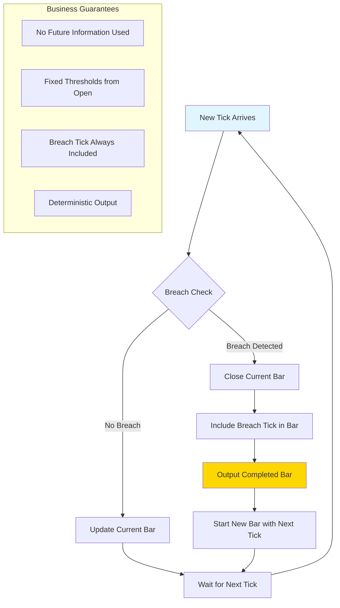

# Business Logic Diagram Proposals

Survey and proposals for Mermaid diagrams to visualize business logic (not technical implementation).

## Proposed Diagram Types

### Option 1: High-Level Business Flow (Recommended First)

**Purpose**: Show the complete business journey from raw data to insights



**What This Shows**:
- 5 major business stages
- Data transformation flow
- End-to-end value chain

---

### Option 2: Business Use Cases by User Type

**Purpose**: Who uses this system for what business objectives?



**What This Shows**:
- 3 user personas
- 9 distinct business use cases
- How different users interact with the system

---

### Option 3: Data Acquisition Decision Tree

**Purpose**: Business logic for choosing data sources and markets



**What This Shows**:
- Business decision: asset class selection
- Available data sources per asset class
- Unified validation regardless of source

---

### Option 4: Processing Mode Decision Logic

**Purpose**: Business logic for choosing streaming vs batch mode



**What This Shows**:
- Business decision factors (use case, memory, size, needs)
- 3 processing modes (streaming, batch, simple)
- Different outputs per mode

---

### Option 5: Threshold Selection Guide

**Purpose**: Business logic for choosing optimal threshold based on trading strategy



**What This Shows**:
- 4 trading styles
- Threshold ranges per style
- Expected bar frequency (business outcome)

---

### Option 6: Complete Business Workflow (Detailed)

**Purpose**: Comprehensive end-to-end business process with all decision points



**What This Shows**:
- 7 business stages
- 2 major decision points
- Multiple paths to business value

---

### Option 7: Error Recovery Business Logic

**Purpose**: Business decisions when things go wrong



**What This Shows**:
- 6 failure scenarios
- Business-appropriate responses per scenario
- Recovery paths vs. stop conditions

---

### Option 8: Cross-Market Comparison Workflow

**Purpose**: Business logic for comparing liquidity and volatility across markets



**What This Shows**:
- Parallel data fetching (business efficiency)
- Unified processing across markets
- 3 business insights derived

---

### Option 9: Algorithm Business Rules (Non-Lookahead)

**Purpose**: Core business logic guarantees (what makes this system trustworthy)



**What This Shows**:
- 4 business guarantees (trust factors)
- Decision logic: breach vs. no breach
- State machine: update → close → new

---

## Recommended Diagram Combinations

### For New Users (Business Overview)
1. **Option 1**: High-Level Business Flow (see the big picture)
2. **Option 2**: Business Use Cases (understand who uses it for what)
3. **Option 5**: Threshold Selection Guide (practical decision making)

### For Researchers (Data Analysis Focus)
1. **Option 3**: Data Acquisition Decision Tree (choose data sources)
2. **Option 4**: Processing Mode Decision Logic (optimize for your use case)
3. **Option 8**: Cross-Market Comparison Workflow (analytical workflows)

### For Live Traders (Production Focus)
1. **Option 9**: Algorithm Business Rules (understand guarantees)
2. **Option 4**: Processing Mode Decision Logic (real-time considerations)
3. **Option 7**: Error Recovery Business Logic (handle failures)

### For Portfolio Managers (Strategic Focus)
1. **Option 8**: Cross-Market Comparison Workflow (market analysis)
2. **Option 6**: Complete Business Workflow (end-to-end process)
3. **Option 2**: Business Use Cases (strategic applications)

---

## Implementation Recommendation

**Proposed Location**: `docs/diagrams/business-logic.md`

**Structure**:
```
docs/diagrams/
├── business-logic.md          # All business logic diagrams
├── data-flow.md               # Data transformation focus
├── decision-trees.md          # All decision logic
└── workflows.md               # Complete workflows
```

**Or Single File**: `docs/BUSINESS_LOGIC.md` (simpler, all diagrams in one place)

---

## Next Steps

**Please indicate your preference**:

1. **Which diagram types** are most valuable for your understanding? (Pick 3-5)
2. **Organization preference**: Single file or multiple files?
3. **Additional business logic** you want visualized?
4. **Diagram style preference**:
   - More colors/styling?
   - More detailed?
   - Simpler/cleaner?

Once you confirm, I'll create the full documentation with your selected diagrams in proper Mermaid format.
